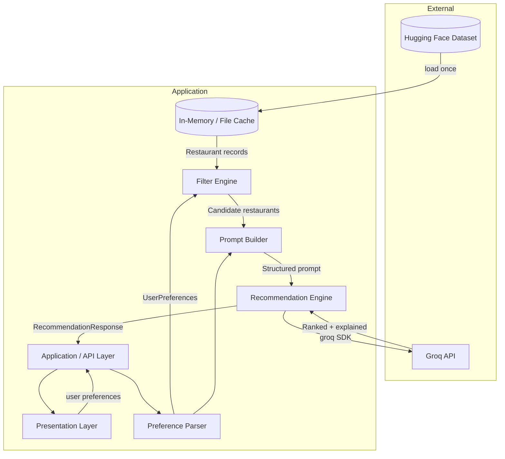
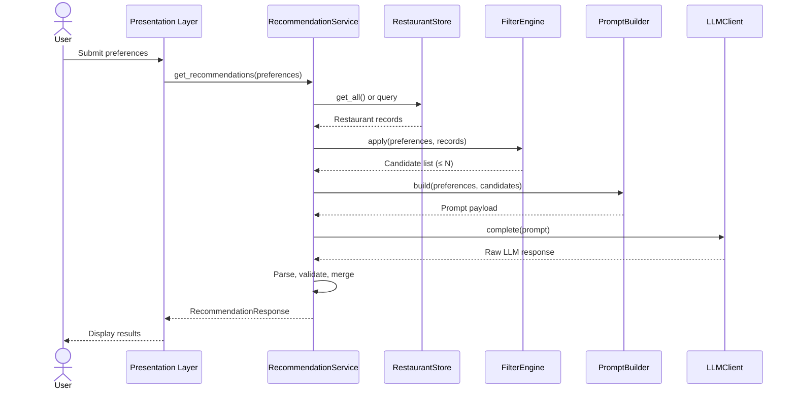
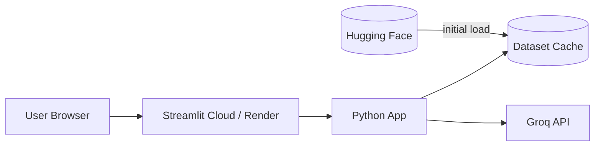

# Architecture: AI-Powered Restaurant Recommendation System

> Derived from [`Docs/context.md`](./context.md) and [`Docs/ProblemStatement`](./ProblemStatement)

---

## 1. Executive Summary

This document describes the technical architecture for a Zomato-inspired restaurant recommendation application. The system combines **structured filtering** over a real-world Zomato dataset with **LLM-based reasoning** to produce ranked, explainable restaurant recommendations.

The design follows a **hybrid retrieval + generation** pattern:

1. **Retrieve** — Narrow the candidate set using deterministic filters on structured data.
2. **Reason** — Pass a bounded subset to **Groq** for ranking, explanation, and optional summarization.
3. **Render** — Present results in a consistent, user-friendly format.

This separation keeps LLM token usage bounded, improves latency, and ensures recommendations are grounded in actual dataset records.

---

## 2. Design Principles

| Principle | Rationale |
|-----------|-----------|
| **Grounded recommendations** | Every suggestion must map to a real restaurant record from the dataset. |
| **Filter first, LLM second** | Structured filters reduce noise and token cost before LLM invocation. |
| **Explainability by default** | Each recommendation includes a human-readable rationale. |
| **Modular layers** | Data, filtering, LLM, and presentation are independently replaceable. |
| **Graceful degradation** | If the LLM fails, return filter-ranked results without explanations. |

---

## 3. High-Level Architecture



---

## 4. Logical Component Architecture

```
┌─────────────────────────────────────────────────────────────────────────────┐
│                         PRESENTATION LAYER                                   │
│  ┌─────────────────────┐  ┌─────────────────────┐  ┌─────────────────────┐  │
│  │ Preference Form     │  │ Results List        │  │ Summary Panel       │  │
│  │ (location, budget,  │  │ (name, cuisine,     │  │ (optional LLM       │  │
│  │  cuisine, rating)   │  │  rating, cost,      │  │  overview)          │  │
│  │                     │  │  explanation)       │  │                     │  │
│  └─────────────────────┘  └─────────────────────┘  └─────────────────────┘  │
└─────────────────────────────────────────────────────────────────────────────┘
                                      │
                                      ▼
┌─────────────────────────────────────────────────────────────────────────────┐
│                         APPLICATION LAYER                                    │
│  ┌──────────────────────────────────────────────────────────────────────┐   │
│  │ RecommendationService                                                 │   │
│  │  orchestrates: parse → filter → prompt → LLM → validate → respond   │   │
│  └──────────────────────────────────────────────────────────────────────┘   │
└─────────────────────────────────────────────────────────────────────────────┘
                                      │
          ┌───────────────────────────┼───────────────────────────┐
          ▼                           ▼                           ▼
┌──────────────────┐      ┌──────────────────┐      ┌──────────────────┐
│ DATA LAYER       │      │ FILTER LAYER     │      │ LLM LAYER        │
│                  │      │                  │      │                  │
│ DatasetLoader    │      │ PreferenceParser │      │ PromptBuilder    │
│ DataPreprocessor │      │ FilterEngine     │      │ LLMClient        │
│ RestaurantStore  │      │ CandidateRanker  │      │ ResponseParser   │
└──────────────────┘      └──────────────────┘      └──────────────────┘
          │                           │                           │
          └───────────────────────────┴───────────────────────────┘
                                      │
                                      ▼
                          ┌──────────────────┐
                          │ EXTERNAL DATA    │
                          │ Hugging Face     │
                          │ Zomato Dataset   │
                          └──────────────────┘
```

---

## 5. Component Specifications

### 5.1 Data Layer

**Responsibility:** Load, normalize, and serve restaurant records.

| Component | Role |
|-----------|------|
| `DatasetLoader` | Fetches dataset from Hugging Face (`ManikaSaini/zomato-restaurant-recommendation`) via `datasets` library. |
| `DataPreprocessor` | Cleans nulls, normalizes location/cuisine strings, maps cost to budget tiers, coerces ratings to float. |
| `RestaurantStore` | In-memory index (list or DataFrame) with optional persistence to Parquet/JSON for faster cold starts. |

**Lifecycle:**

```
Startup → Load from HF (or cache) → Preprocess → Store in memory → Ready
```

**Extracted fields (minimum):**

| Field | Type | Notes |
|-------|------|-------|
| `name` | string | Restaurant name |
| `location` | string | City / locality |
| `cuisine` | string or list | May be comma-separated in raw data |
| `cost` | number or string | Normalize to numeric or tier (low/medium/high) |
| `rating` | float | Minimum 0, maximum 5 |
| `id` | string | Stable identifier for LLM grounding |

Additional fields (address, votes, etc.) may be included if present in the dataset and useful for filtering or prompts.

---

### 5.2 Preference Parser

**Responsibility:** Validate and normalize user input into a structured `UserPreferences` object.

```python
UserPreferences:
  location: str              # e.g. "Bangalore"
  budget: Literal["low", "medium", "high"]
  cuisine: str | None        # e.g. "Italian"
  min_rating: float          # e.g. 4.0
  additional: list[str]      # e.g. ["family-friendly", "quick service"]
  top_k: int = 5             # number of recommendations to return
```

**Validation rules:**

- `location` — required; case-insensitive match against known cities in dataset
- `budget` — required; enum mapping to cost ranges (configurable thresholds)
- `min_rating` — optional, default `0.0`; clamp to `[0, 5]`
- `cuisine` — optional; fuzzy or substring match against dataset cuisines
- `additional` — free-text tags passed through to LLM for semantic matching

---

### 5.3 Filter Engine

**Responsibility:** Deterministically narrow the restaurant corpus before LLM invocation.

**Filter pipeline (sequential, AND logic):**

```
All restaurants
  → filter by location (exact or normalized city match)
  → filter by min_rating
  → filter by cuisine (if specified)
  → filter by budget tier (if mappable from cost field)
  → sort by rating (desc) as pre-rank
  → take top N candidates (e.g. N = 20) for LLM context window
```

**Budget tier mapping (configurable):**

| Tier | Example cost range (₹ for two) |
|------|--------------------------------|
| Low | ≤ 500 |
| Medium | 501 – 1500 |
| High | > 1500 |

> Exact thresholds should be calibrated after inspecting the dataset's cost field format.

**Fallback behavior:**

- If zero matches after strict filtering → relax filters in order: cuisine → budget → min_rating → return message to user
- If still zero → suggest available locations/cuisines from dataset metadata

---

### 5.4 Prompt Builder

**Responsibility:** Construct a structured, grounded prompt for the LLM.

**Prompt structure:**

1. **System message** — Role, constraints, output format (JSON preferred)
2. **User context** — Serialized `UserPreferences`
3. **Candidate restaurants** — JSON array of filtered records (bounded to top N)
4. **Task instructions** — Rank, explain, optionally summarize

**Example output schema (enforced via prompt + parser):**

```json
{
  "summary": "Optional one-paragraph overview of the selection",
  "recommendations": [
    {
      "restaurant_id": "string",
      "name": "string",
      "rank": 1,
      "explanation": "Why this fits the user's preferences"
    }
  ]
}
```

**Prompt design constraints:**

- Instruct LLM to **only** recommend from provided candidates
- Require explanations to reference specific user preferences
- Cap output to `top_k` recommendations
- Use low temperature (0.2–0.4) for consistent ranking

---

### 5.5 Recommendation Engine (LLM Layer)

**Responsibility:** Invoke LLM, parse response, merge with structured data, validate output.

| Component | Role |
|-----------|------|
| `LLMClient` | Groq client wrapper using the official `groq` Python SDK (`chat.completions.create`). |
| `ResponseParser` | Parse JSON from LLM; handle markdown fences and malformed output. |
| `RecommendationValidator` | Ensure every `restaurant_id` exists in candidate set; drop hallucinations. |
| `RecommendationMerger` | Enrich LLM output with full record fields (cuisine, rating, cost). |

**Request flow:**

```
PromptBuilder.build(preferences, candidates)
  → LLMClient.complete(prompt)
  → ResponseParser.parse(raw_text)
  → RecommendationValidator.validate(parsed, candidates)
  → RecommendationMerger.merge(parsed, candidates)
  → RecommendationResponse
```

**Fallback on LLM failure:**

Return top `top_k` candidates from Filter Engine sorted by rating, with a generic explanation template or no explanation.

---

### 5.6 Presentation Layer

**Responsibility:** Collect input and render recommendations.

Two supported deployment modes:

| Mode | Stack | Use case |
|------|-------|----------|
| **Web UI** | Streamlit or Gradio | Rapid demo, PM fellowship submission |
| **CLI** | Python argparse / Typer | Local testing, scripting |

**UI sections:**

1. **Input form** — Location dropdown (populated from dataset), budget selector, cuisine input, rating slider, optional tags
2. **Loading state** — During filter + LLM call
3. **Results cards** — One card per recommendation with all required fields
4. **Summary block** — Optional LLM-generated overview

---

## 6. Data Flow (End-to-End)



---

## 7. Data Models

### 7.1 Restaurant (internal)

```python
Restaurant:
  id: str
  name: str
  location: str
  cuisine: str
  cost: float | str
  rating: float
  # optional extended fields from dataset
```

### 7.2 Recommendation (API response)

```python
Recommendation:
  rank: int
  name: str
  cuisine: str
  rating: float
  estimated_cost: str | float
  explanation: str

RecommendationResponse:
  summary: str | None
  recommendations: list[Recommendation]
  metadata:
    total_candidates: int
    filters_applied: dict
    llm_used: bool
```

---

## 8. Recommended Project Structure

```
zomato-recommender/
├── app/
│   ├── __init__.py
│   ├── main.py                 # Entry point (Streamlit / FastAPI)
│   ├── config.py               # Env vars, budget thresholds, top_k defaults
│   ├── models/
│   │   ├── preferences.py      # UserPreferences
│   │   └── recommendation.py   # Recommendation, RecommendationResponse
│   ├── data/
│   │   ├── loader.py           # Hugging Face dataset loading
│   │   ├── preprocessor.py     # Cleaning & normalization
│   │   └── store.py            # In-memory restaurant store
│   ├── filters/
│   │   ├── parser.py           # Input validation
│   │   └── engine.py           # Filter pipeline
│   ├── llm/
│   │   ├── client.py           # Groq client wrapper
│   │   ├── prompts.py          # Prompt templates
│   │   └── parser.py           # Response parsing & validation
│   └── services/
│       └── recommendation.py   # Orchestration service
├── ui/
│   └── streamlit_app.py        # UI components (if separated)
├── tests/
│   ├── test_filters.py
│   ├── test_preprocessor.py
│   └── test_llm_parser.py
├── data/
│   └── cache/                  # Optional cached dataset (gitignored)
├── .env.example                # Groq API key
├── requirements.txt
└── README.md
```

---

## 9. Technology Stack

| Layer | Recommended | Alternatives |
|-------|-------------|--------------|
| Language | Python 3.10+ | — |
| Dataset | `datasets` (Hugging Face) | Manual CSV download |
| Data processing | `pandas` | Polars |
| LLM | **Groq** (`llama-3.3-70b-versatile`) | `llama-3.1-8b-instant` for lower latency |
| LLM SDK | `groq` (official Python client) | — |
| UI | Streamlit | Gradio, React + FastAPI |
| API (optional) | FastAPI | Flask |
| Config | `python-dotenv` | pydantic-settings |
| Testing | `pytest` | unittest |

---

## 10. Configuration & Environment

```env
# .env
GROQ_API_KEY=gsk_...
LLM_MODEL=llama-3.3-70b-versatile   # or llama-3.1-8b-instant
LLM_TEMPERATURE=0.3
MAX_CANDIDATES_FOR_LLM=20
DEFAULT_TOP_K=5
DATASET_CACHE_PATH=./data/cache/restaurants.parquet
BUDGET_LOW_MAX=500
BUDGET_MEDIUM_MAX=1500
```

All thresholds and provider settings live in `config.py` and are overridable via environment variables.

---

## 11. LLM Integration Details

### 11.1 Why hybrid (filter + LLM)?

| Approach | Pros | Cons |
|----------|------|------|
| LLM only | Flexible natural language | Expensive, slow, hallucination risk |
| Filters only | Fast, deterministic | No personalization or explanations |
| **Hybrid (chosen)** | Grounded, explainable, cost-efficient | Requires prompt engineering |

### 11.2 Token budget strategy

- Pass at most **20 candidate restaurants** to the LLM (configurable)
- Include only essential fields per candidate: `id`, `name`, `cuisine`, `rating`, `cost`, `location`
- Omit full dataset from prompt

### 11.3 Hallucination prevention

1. Provide explicit candidate list in prompt
2. Instruct: "Recommend ONLY from the provided list"
3. Post-validate: reject any `restaurant_id` not in candidates
4. Use structured JSON output with schema in prompt

### 11.4 Groq integration

Groq is the **sole LLM provider** for this project. It is used for ranking, per-restaurant explanations, and optional summary generation.

| Aspect | Detail |
|--------|--------|
| **Provider** | [Groq](https://groq.com/) |
| **SDK** | `groq` Python package |
| **Default model** | `llama-3.3-70b-versatile` — strong reasoning for ranking and explanations |
| **Fast alternative** | `llama-3.1-8b-instant` — lower latency for demos |
| **API endpoint** | Groq Chat Completions API |
| **Auth** | `GROQ_API_KEY` environment variable |

**Client implementation pattern:**

```python
from groq import Groq

client = Groq(api_key=settings.GROQ_API_KEY)
response = client.chat.completions.create(
    model=settings.LLM_MODEL,
    messages=[
        {"role": "system", "content": system_prompt},
        {"role": "user", "content": user_prompt},
    ],
    temperature=settings.LLM_TEMPERATURE,
    response_format={"type": "json_object"},  # when supported by model
)
```

**Why Groq:**

- High inference speed — supports the < 5s latency target after filtering
- OpenAI-compatible chat completions API — straightforward SDK integration
- Cost-effective for fellowship/demo workloads
- Capable open-weight models (Llama 3.x) suitable for structured JSON output

**Groq-specific error handling:**

- **Rate limits (429)** — exponential backoff retry (max 2 retries)
- **Model unavailable** — fallback to `llama-3.1-8b-instant` if configured as secondary
- **Invalid API key** — fail fast with clear UI message

---

## 12. Error Handling & Edge Cases

| Scenario | Handling |
|----------|----------|
| Dataset load failure | Retry once; show cached copy if available; fail with clear error |
| No restaurants match filters | Progressive filter relaxation; suggest alternatives |
| Groq timeout / API error | Return filter-ranked results without explanations; log error |
| Groq rate limit (429) | Retry with backoff; fallback to filter ranking if retries exhausted |
| Malformed LLM JSON | Retry with repair prompt once; fallback to filter ranking |
| Unknown location | Fuzzy match against dataset cities; suggest closest matches |
| Empty cuisine in dataset row | Exclude from cuisine filter or treat as "Multi-cuisine" |

---

## 13. Non-Functional Requirements

| Requirement | Target |
|-------------|--------|
| **Latency** | < 5s end-to-end (excluding first dataset load) |
| **Cold start** | Dataset cached locally after first load |
| **Scalability** | Single-user demo; architecture supports FastAPI horizontal scaling later |
| **Observability** | Log filter counts, LLM latency, token usage |
| **Security** | API keys in env only; never log prompts containing secrets |

---

## 14. Deployment Architecture

### 14.1 Local development

```
streamlit run ui/streamlit_app.py
```

Dataset loads on startup; Groq calls require a valid `GROQ_API_KEY` in `.env`.

### 14.2 Optional cloud deployment



---

## 15. Testing Strategy

| Test type | Scope |
|-----------|-------|
| **Unit** | Preprocessor normalization, budget tier mapping, filter logic |
| **Integration** | Dataset load → filter → mock LLM → response merge |
| **LLM parser** | Valid JSON, markdown-wrapped JSON, invalid output fallback |
| **E2E (manual)** | Submit preferences in UI; verify grounded recommendations |

Mock the `LLMClient` in tests to avoid API costs and ensure deterministic CI.

---

## 16. Future Extensions

| Extension | Description |
|-----------|-------|
| **Semantic search** | Embed restaurant descriptions; vector search for "additional preferences" |
| **Conversation mode** | Multi-turn refinement ("make it cheaper", "something outdoors") |
| **User profiles** | Persist preferences and history |
| **Maps integration** | Show restaurant locations on a map |
| **A/B ranking** | Compare LLM ranking vs. pure rating sort |

---

## 17. Architecture Decision Records (ADR)

### ADR-001: Hybrid filter + LLM over LLM-only

**Decision:** Use deterministic filters before LLM ranking.

**Reason:** Grounds output in real data, reduces cost, improves latency.

### ADR-002: Bounded candidate set (N ≤ 20)

**Decision:** Pass only top-N filter results to LLM.

**Reason:** Fits context window, controls token cost, forces focus on best matches.

### ADR-003: JSON-structured LLM output

**Decision:** Require JSON response schema from LLM.

**Reason:** Enables reliable parsing and validation; reduces free-text parsing bugs.

### ADR-004: Streamlit for initial UI

**Decision:** Use Streamlit for v1 presentation layer.

**Reason:** Fastest path to demo; aligns with fellowship prototype scope.

### ADR-005: Groq as LLM provider

**Decision:** Use Groq (via official `groq` SDK) with `llama-3.3-70b-versatile` as the default model.

**Reason:** Fast inference, simple API integration, cost-effective for prototype scope, and sufficient quality for ranking and explanation generation.

---

## 18. References

- Project context: [`Docs/context.md`](./context.md)
- Problem statement: [`Docs/ProblemStatement`](./ProblemStatement)
- Dataset: [ManikaSaini/zomato-restaurant-recommendation](https://huggingface.co/datasets/ManikaSaini/zomato-restaurant-recommendation)
- LLM provider: [Groq](https://groq.com/) · [Groq Python SDK](https://github.com/groq/groq-python) · [Groq model docs](https://console.groq.com/docs/models)
