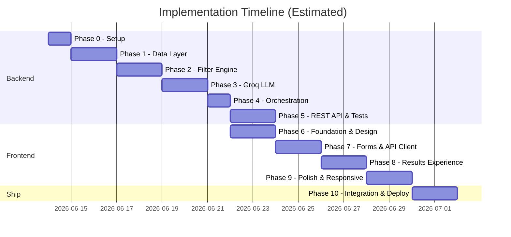

# Phase-Wise Implementation Plan

> AI-Powered Restaurant Recommendation System (Zomato Use Case)

**Sources:** [`Docs/context.md`](./context.md) · [`Docs/architecture.md`](./architecture.md)

---

## Overview

This plan splits the project into **two independent tracks**:

| Track | Phases | Goal |
|-------|--------|------|
| **Backend** | 0–5 | Data pipeline, filtering, Groq LLM, orchestration, REST API |
| **Frontend** | 6–9 | Production-quality web UI consuming the API |

Phases 0–5 deliver a complete, testable backend. Phases 6–9 deliver a polished, Zomato-inspired frontend. Phase 10 covers integration, docs, and optional deployment.



**Estimated total:** 14–16 working days (Phase 10 deployment optional)

> **Parallel work:** Frontend Phase 6 can start once Phase 4 (orchestration) is done, using mock API responses. Phase 7 requires Phase 5 (REST API) for live integration.

---

## Phase Summary

### Backend Track

| Phase | Name | Goal | Est. Duration |
|-------|------|------|---------------|
| 0 | Project Setup | Repo scaffold, deps, config | 0.5–1 day |
| 1 | Data Layer | Load, preprocess, cache Zomato dataset | 1–2 days |
| 2 | Filter Engine | Preference parsing + deterministic filtering | 1–2 days |
| 3 | Groq LLM Layer | Prompts, client, response parsing | 1–2 days |
| 4 | Orchestration | End-to-end `RecommendationService` | 1 day |
| 5 | REST API & Backend Tests | FastAPI endpoints, pytest, edge cases | 1–2 days |

### Frontend Track

| Phase | Name | Goal | Est. Duration |
|-------|------|------|---------------|
| 6 | Foundation & Design System | React app, Tailwind, tokens, base components | 1–2 days |
| 7 | Preference Form & API Client | Input UX, validation, typed API integration | 1–2 days |
| 8 | Results Experience | Recommendation cards, summary, loading/error states | 1–2 days |
| 9 | Polish & Responsive | Animations, accessibility, mobile layout | 1–2 days |

### Integration

| Phase | Name | Goal | Est. Duration |
|-------|------|------|---------------|
| 10 | Integration, Docs & Deploy *(optional deploy)* | E2E tests, README, cloud hosting | 1–2 days |

---

# Part I — Backend Track

---

## Phase 0: Project Setup & Foundation

### Goal

Establish project structure, dependencies, and configuration so later phases can be built incrementally.

### Prerequisites

- Python 3.10+ installed
- Node.js 20+ installed (for frontend scaffold in Phase 6)
- Groq API key ([console.groq.com](https://console.groq.com/))

### Tasks

- [ ] Initialize project directory per architecture layout
- [ ] Create `requirements.txt` with core dependencies:
  - `datasets`, `pandas`, `groq`, `fastapi`, `uvicorn`, `python-dotenv`, `pytest`, `httpx`
- [ ] Add `.env.example` with `GROQ_API_KEY`, `LLM_MODEL`, budget thresholds, `CORS_ORIGINS`
- [ ] Add `.gitignore` (`.env`, `data/cache/`, `__pycache__/`, `.venv/`, `frontend/node_modules/`, `frontend/dist/`)
- [ ] Implement `app/config.py` — load env vars with sensible defaults
- [ ] Create empty package stubs under `app/` (models, data, filters, llm, services, api)
- [ ] Add placeholder `README.md` with setup instructions
- [ ] Reserve `frontend/` directory for Phase 6

### Files to Create

```
zomato-recommender/
├── app/
│   ├── __init__.py
│   ├── config.py
│   ├── models/__init__.py
│   ├── data/__init__.py
│   ├── filters/__init__.py
│   ├── llm/__init__.py
│   ├── services/__init__.py
│   └── api/__init__.py          # FastAPI routes (Phase 5)
├── frontend/                    # React app (Phase 6+)
├── scripts/
├── tests/
├── data/cache/
├── .env.example
├── .gitignore
└── requirements.txt
```

### Acceptance Criteria

- [ ] `pip install -r requirements.txt` succeeds
- [ ] `app/config.py` reads `GROQ_API_KEY` and `LLM_MODEL` from environment
- [ ] Project imports without errors: `python -c "from app.config import settings"`

### Deliverable

Runnable project skeleton with configuration in place.

---

## Phase 1: Data Layer

### Goal

Load the Zomato dataset from Hugging Face, preprocess it, and serve normalized restaurant records from an in-memory store (with optional local cache).

### Depends On

Phase 0

### Tasks

- [ ] **Explore dataset** — Inspect raw schema from [Hugging Face dataset](https://huggingface.co/datasets/ManikaSaini/zomato-restaurant-recommendation); document actual column names
- [ ] Implement `app/models/restaurant.py` — `Restaurant` dataclass/Pydantic model
- [ ] Implement `app/data/loader.py`:
  - Load via `datasets.load_dataset("ManikaSaini/zomato-restaurant-recommendation")`
  - Retry once on failure
- [ ] Implement `app/data/preprocessor.py`:
  - Clean nulls / invalid rows
  - Normalize `location`, `cuisine` (case, whitespace, comma-separated cuisines)
  - Coerce `rating` to float (clamp 0–5)
  - Parse `cost` field — map to numeric value and budget tier (low/medium/high)
  - Assign stable `id` per record (index or hash)
- [ ] Implement `app/data/store.py`:
  - Hold preprocessed records in memory (DataFrame or list)
  - Expose `get_all()`, `get_locations()`, `get_cuisines()`
  - Optional: persist to Parquet at `DATASET_CACHE_PATH` for faster restarts
- [ ] Write `tests/test_preprocessor.py` — normalization edge cases

### Key Decisions (resolve during this phase)

| Decision | Action |
|----------|--------|
| Cost field format | Inspect dataset; adjust budget tier thresholds in `config.py` |
| Location granularity | City-level vs locality — normalize to city for filtering |
| Missing ratings | Drop or default to 0.0 |

### Acceptance Criteria

- [ ] Dataset loads successfully from Hugging Face
- [ ] Preprocessed records contain: `id`, `name`, `location`, `cuisine`, `cost`, `rating`
- [ ] `RestaurantStore.get_locations()` returns distinct cities for UI dropdown
- [ ] Cached Parquet loads on second startup (if cache enabled)
- [ ] Unit tests for preprocessor pass

### Deliverable

Working data pipeline: Hugging Face → preprocess → in-memory store.

---

## Phase 2: Filter Engine & Preference Parser

### Goal

Accept structured user preferences, validate them, and deterministically filter the restaurant corpus before any LLM call.

### Depends On

Phase 1

### Tasks

- [ ] Implement `app/models/preferences.py` — `UserPreferences` model:
  ```python
  location: str
  budget: Literal["low", "medium", "high"]
  cuisine: str | None
  min_rating: float = 0.0
  additional: list[str] = []
  top_k: int = 5
  ```
- [ ] Implement `app/filters/parser.py`:
  - Validate location against known cities from `RestaurantStore`
  - Clamp `min_rating` to [0, 5]
  - Normalize budget enum
- [ ] Implement `app/filters/engine.py` — filter pipeline:
  1. Filter by location (case-insensitive)
  2. Filter by `min_rating`
  3. Filter by cuisine (substring match, if provided)
  4. Filter by budget tier (using cost thresholds from config)
  5. Sort by rating descending
  6. Return top N candidates (`MAX_CANDIDATES_FOR_LLM`, default 20)
- [ ] Implement **fallback logic** when zero matches:
  - Relax filters in order: cuisine → budget → min_rating
  - Return metadata indicating which filters were relaxed
- [ ] Write `tests/test_filters.py`:
  - Location + rating filter
  - Budget tier mapping
  - Zero-result fallback
  - Candidate cap at N

### Acceptance Criteria

- [ ] Given preferences `{location: "Bangalore", budget: "medium", min_rating: 4.0}`, engine returns ≤ 20 candidates sorted by rating
- [ ] All returned candidates exist in the dataset (grounded)
- [ ] Zero-match scenario triggers progressive filter relaxation
- [ ] Filter tests pass without LLM involvement

### Deliverable

Deterministic filter pipeline producing a bounded candidate list from user preferences.

---

## Phase 3: Groq LLM Layer

### Goal

Integrate Groq for ranking, explanation generation, and optional summary — with structured JSON output and hallucination prevention.

### Depends On

Phase 2

### Tasks

- [ ] Implement `app/llm/prompts.py`:
  - System prompt: role, constraints, JSON output schema
  - User prompt template: serialize `UserPreferences` + candidate JSON array
  - Instructions: rank only from provided list, reference user preferences in explanations
- [ ] Implement `app/llm/client.py` — Groq wrapper:
  - Use `groq` SDK with `chat.completions.create`
  - Model: `llama-3.3-70b-versatile` (configurable)
  - Temperature: 0.3
  - Retry on 429 with exponential backoff (max 2 retries)
- [ ] Implement `app/llm/parser.py`:
  - `ResponseParser` — extract JSON from raw response (handle markdown fences)
  - `RecommendationValidator` — reject `restaurant_id` values not in candidate set
  - `RecommendationMerger` — enrich with `cuisine`, `rating`, `cost` from candidates
- [ ] Implement `app/models/recommendation.py`:
  ```python
  Recommendation(rank, name, cuisine, rating, estimated_cost, explanation)
  RecommendationResponse(summary, recommendations, metadata)
  ```
- [ ] Write `tests/test_llm_parser.py`:
  - Valid JSON parsing
  - Markdown-wrapped JSON
  - Hallucinated restaurant_id rejection
  - Malformed JSON fallback behavior

### Prompt Output Schema

```json
{
  "summary": "Optional overview",
  "recommendations": [
    {
      "restaurant_id": "string",
      "name": "string",
      "rank": 1,
      "explanation": "Why this fits"
    }
  ]
}
```

### Acceptance Criteria

- [ ] Groq API call returns parsed, validated recommendations
- [ ] Every recommendation maps to a candidate from the filter engine (no hallucinations)
- [ ] Explanations reference user preferences (location, budget, cuisine, etc.)
- [ ] On Groq failure, system returns filter-ranked fallback with `llm_used: false`
- [ ] LLM parser unit tests pass (mocked client)

### Deliverable

Groq-powered recommendation layer with prompt templates, client, and response validation.

---

## Phase 4: Recommendation Service (Orchestration)

### Goal

Wire all layers into a single orchestration service that executes the full pipeline end-to-end.

### Depends On

Phases 1, 2, 3

### Tasks

- [ ] Implement `app/services/recommendation.py` — `RecommendationService`:
  ```
  get_recommendations(preferences) → RecommendationResponse
  ```
  Pipeline:
  1. Parse & validate preferences
  2. Load candidates from `RestaurantStore`
  3. Apply `FilterEngine`
  4. Build prompt via `PromptBuilder`
  5. Call `LLMClient`
  6. Parse, validate, merge response
  7. Return `RecommendationResponse` with metadata
- [ ] Add graceful degradation:
  - LLM failure → filter-ranked results, `llm_used: false`
  - Zero candidates → user-friendly message + suggested locations/cuisines
- [ ] Add basic logging: filter count, LLM latency, token usage
- [ ] Create CLI smoke test (`scripts/predict.py`):
  ```bash
  python scripts/predict.py --location Bangalore --budget medium --min-rating 4.0
  ```

### Acceptance Criteria

- [ ] Single function call produces full recommendation response
- [ ] Response includes all required fields: name, cuisine, rating, cost, explanation
- [ ] Metadata reports `total_candidates`, `filters_applied`, `llm_used`
- [ ] End-to-end CLI run completes in < 5s (after dataset is cached)
- [ ] Graceful fallback works when Groq is unavailable (test with invalid key)

### Deliverable

Working backend pipeline callable from CLI — no UI required yet.

---

## Phase 5: REST API & Backend Testing

### Goal

Expose the recommendation service over HTTP for the frontend, and harden the backend with tests and edge-case handling.

### Depends On

Phase 4

### Tasks

#### REST API (`app/api/`)

- [ ] Implement `app/api/main.py` — FastAPI application with CORS (`CORS_ORIGINS` from config)
- [ ] Implement `app/api/routes/health.py`:
  - `GET /health` — liveness check
  - `GET /ready` — dataset loaded, Groq key present (optional warning)
- [ ] Implement `app/api/routes/metadata.py`:
  - `GET /api/locations` — distinct cities for dropdown
  - `GET /api/cuisines` — distinct cuisines (optional, for autocomplete)
- [ ] Implement `app/api/routes/recommendations.py`:
  - `POST /api/recommendations` — accept `UserPreferences` JSON, return `RecommendationResponse`
  - Request validation via Pydantic; map 4xx for invalid location, 503 for dataset unavailable
- [ ] Add startup event: load `RestaurantStore` once (singleton / lifespan)
- [ ] Add OpenAPI docs at `/docs` for frontend reference

#### API Contract

```json
// POST /api/recommendations
{
  "location": "Bangalore",
  "budget": "medium",
  "cuisine": "Italian",
  "min_rating": 4.0,
  "additional": ["family-friendly"],
  "top_k": 5
}
```

#### Backend Tests & Hardening

- [ ] **Unit tests** — complete coverage for:
  - [ ] `test_preprocessor.py`
  - [ ] `test_filters.py`
  - [ ] `test_llm_parser.py`
- [ ] **API tests** (`tests/test_api.py`) — `httpx.AsyncClient` against FastAPI:
  - [ ] Health endpoints
  - [ ] Recommendations with mocked Groq
  - [ ] Invalid location → 422
- [ ] **Integration test** — dataset load → filter → mock Groq → merge (no live API in CI)
- [ ] **Edge case handling** (verify in code):
  - [ ] Dataset load failure → retry + cache fallback
  - [ ] Unknown location → validation error with suggestions
  - [ ] Groq 429 → retry + fallback
  - [ ] Malformed JSON → repair retry + fallback

### Run Commands

```bash
# Start API server
uvicorn app.api.main:app --reload --port 8000

# Run backend tests
pytest
```

### Acceptance Criteria

- [ ] `POST /api/recommendations` returns full `RecommendationResponse` JSON
- [ ] `GET /api/locations` returns cities from dataset
- [ ] CORS allows `http://localhost:5173` (Vite dev server)
- [ ] `pytest` passes all tests
- [ ] OpenAPI schema matches Pydantic models

### Deliverable

Production-ready backend API with tests — ready for frontend integration.

---

# Part II — Frontend Track

> **Quality bar:** The frontend should feel like a real product demo — not a prototype. Prioritize visual polish, responsive layout, clear feedback, and smooth interactions over feature breadth.

---

## Frontend Tech Stack

| Layer | Choice | Rationale |
|-------|--------|-----------|
| Framework | **React 18 + Vite + TypeScript** | Fast dev, strong typing, industry standard |
| Styling | **Tailwind CSS** | Utility-first, consistent spacing/typography |
| Components | **shadcn/ui** (Radix primitives) | Accessible, customizable, professional look |
| Icons | **Lucide React** | Clean, consistent icon set |
| Data fetching | **TanStack Query** | Caching, loading/error states, retries |
| Forms | **React Hook Form + Zod** | Validation aligned with API schema |
| Animation | **Framer Motion** (light use) | Card entrance, loading transitions |

### Design Direction (Zomato-inspired)

| Element | Guideline |
|---------|-----------|
| **Color** | Primary red `#E23744`, neutral grays, white cards on light gray background |
| **Typography** | Inter or similar sans-serif; clear hierarchy (display / body / caption) |
| **Cards** | Elevated restaurant cards with rank badge, rating pill, cost indicator |
| **Spacing** | Generous padding; max-width container (~1200px) centered |
| **Feedback** | Skeleton loaders during fetch; toast for errors; disabled submit while loading |

---

## Phase 6: Frontend Foundation & Design System

### Goal

Scaffold the React application, establish design tokens, and build reusable base components.

### Depends On

Phase 0 (directory exists); can run in parallel with Backend Phases 1–4 using mock data

### Tasks

- [ ] Initialize Vite + React + TypeScript in `frontend/`:
  ```bash
  npm create vite@latest frontend -- --template react-ts
  ```
- [ ] Install and configure Tailwind CSS
- [ ] Initialize shadcn/ui; add base components: `Button`, `Card`, `Input`, `Select`, `Slider`, `Badge`, `Skeleton`, `Toast`
- [ ] Create design tokens in `frontend/src/styles/`:
  - CSS variables for brand colors, radii, shadows
  - Dark mode tokens optional (stretch goal)
- [ ] Build layout shell components:
  - `AppShell` — header with logo/title, main content area, footer
  - `PageContainer` — responsive max-width wrapper
  - `Header` — Zomato-style branding ("AI Restaurant Recommender")
- [ ] Set up path aliases (`@/components`, `@/lib`, `@/types`)
- [ ] Add `frontend/.env.example` with `VITE_API_BASE_URL=http://localhost:8000`
- [ ] Create TypeScript types mirroring API models (`types/preferences.ts`, `types/recommendation.ts`)

### File Structure

```
frontend/
├── src/
│   ├── components/
│   │   ├── ui/              # shadcn primitives
│   │   └── layout/          # AppShell, Header, PageContainer
│   ├── lib/
│   │   └── utils.ts
│   ├── types/
│   ├── styles/
│   ├── App.tsx
│   └── main.tsx
├── .env.example
├── tailwind.config.ts
└── package.json
```

### Acceptance Criteria

- [ ] `npm run dev` serves app at `http://localhost:5173`
- [ ] Brand colors and typography applied globally
- [ ] Base components render correctly in a style guide / dev page
- [ ] TypeScript types match backend Pydantic models

### Deliverable

Styled app shell with design system and component library ready for feature work.

---

## Phase 7: Preference Form & API Client

### Goal

Build the preference input experience and wire it to the backend API.

### Depends On

Phase 5 (live API); Phase 6 complete

### Tasks

- [ ] Implement `lib/api-client.ts`:
  - Typed fetch wrapper with base URL from env
  - `getLocations()`, `getCuisines()`, `postRecommendations()`
  - Error mapping (network, 4xx, 5xx → user-friendly messages)
- [ ] Configure TanStack Query provider and query keys
- [ ] Implement `hooks/useLocations.ts` — fetch and cache locations on mount
- [ ] Implement `components/PreferenceForm.tsx`:
  - Location — searchable `Select` populated from API
  - Budget — segmented control or radio group (Low / Medium / High)
  - Cuisine — text input with optional autocomplete from `/api/cuisines`
  - Min rating — slider with live value label (0.0 – 5.0)
  - Additional preferences — tag input or multi-line textarea
  - Submit button — "Get Recommendations"
- [ ] Form validation with Zod schema (mirror backend `UserPreferences`)
- [ ] Disable submit + show inline validation errors
- [ ] Handle API-unavailable state — banner if `/health` fails

### Form Wireframe

```
┌─────────────────────────────────────────────────────┐
│  Find your next meal                                │
│  Tell us what you're craving                        │
├─────────────────────────────────────────────────────┤
│  Location *     [ Bangalore          ▼ ]            │
│  Budget *       ( Low ) (● Medium ) ( High )        │
│  Cuisine        [ Italian              ]            │
│  Min Rating     [========●=====] 4.0                │
│  Extras         [ family-friendly, quick service ]  │
│                                                     │
│              [ Get Recommendations → ]              │
└─────────────────────────────────────────────────────┘
```

### Acceptance Criteria

- [ ] Location dropdown loads from `GET /api/locations`
- [ ] Form validates before submit; invalid fields highlighted
- [ ] Successful submit calls `POST /api/recommendations`
- [ ] Submit button disabled during request
- [ ] API errors surfaced via toast or inline alert

### Deliverable

Fully functional preference form connected to backend API.

---

## Phase 8: Results Experience

### Goal

Present AI recommendations in an engaging, scannable layout with proper loading and empty states.

### Depends On

Phase 7

### Tasks

- [ ] Implement `components/RecommendationCard.tsx`:
  - Rank badge (#1, #2, …) with accent for top pick
  - Restaurant name (prominent)
  - Cuisine + location subtitle
  - Rating display (star icon + numeric)
  - Cost indicator (₹ symbols or formatted range)
  - Explanation block — quoted or italic, readable line length
- [ ] Implement `components/SummaryPanel.tsx` — LLM overview paragraph (if present)
- [ ] Implement `components/ResultsList.tsx` — staggered card list from response
- [ ] Implement `components/ResultsSection.tsx` — orchestrates summary + list + metadata
- [ ] **Loading state** — skeleton cards (3–5 placeholders) while fetching
- [ ] **Empty state** — no matches: friendly message + suggested locations/cuisines from metadata
- [ ] **Error state** — retry button, link to check API key setup
- [ ] **Fallback indicator** — subtle badge when `llm_used: false` ("Ranked by rating")
- [ ] Smooth scroll to results after submit

### Results Wireframe

```
┌─────────────────────────────────────────────────────┐
│  Summary                                            │
│  "Based on your preferences in Bangalore, here are  │
│   five Italian spots that fit your medium budget…"  │
├─────────────────────────────────────────────────────┤
│  ┌─ #1 ──────────────────────────────────────────┐  │
│  │  Truffles                    ★ 4.5   ₹₹₹     │  │
│  │  Italian · Bangalore                          │  │
│  │  "Great fit for your medium budget and love   │  │
│  │   of Italian cuisine with a 4.5 rating…"      │  │
│  └───────────────────────────────────────────────┘  │
│  ┌─ #2 ──────────────────────────────────────────┐  │
│  │  …                                            │  │
│  └───────────────────────────────────────────────┘  │
│  Showing 5 of 18 candidates · AI-powered ranking    │
└─────────────────────────────────────────────────────┘
```

### Acceptance Criteria

- [ ] All 5 output fields displayed per recommendation (name, cuisine, rating, cost, explanation)
- [ ] Summary shown when LLM provides one
- [ ] Skeleton loaders visible during API call
- [ ] Empty and error states are clear and actionable
- [ ] Results animate in (subtle fade/slide)

### Deliverable

Complete recommendation display flow from submit to results.

---

## Phase 9: Polish, Responsive & Accessibility

### Goal

Elevate the UI to production-demo quality across devices and assistive technologies.

### Depends On

Phase 8

### Tasks

- [ ] **Responsive layout:**
  - Desktop: two-column (form left, results right) or stacked with sticky form
  - Tablet/mobile: single column, full-width cards
- [ ] **Micro-interactions:**
  - Button hover/active states
  - Card hover elevation
  - Loading spinner on submit
  - Framer Motion entrance for result cards
- [ ] **Accessibility:**
  - Keyboard navigation for form controls
  - `aria-label` on slider, selects, buttons
  - Focus rings visible; color contrast ≥ 4.5:1
  - Screen reader announcements for loading complete
- [ ] **Performance:**
  - Code-split if needed; lazy load results section
  - Debounce cuisine autocomplete
- [ ] **Edge cases in UI:**
  - Double-submit prevention
  - Stale results cleared on new search
  - Long restaurant names / explanations truncate gracefully
- [ ] **Optional enhancements:**
  - "Share results" copy link
  - Recent searches in `localStorage`
  - Empty-state illustration

### Acceptance Criteria

- [ ] Usable on viewport widths 375px – 1440px without horizontal scroll
- [ ] Lighthouse accessibility score ≥ 90 (local audit)
- [ ] No layout shift during loading → results transition
- [ ] App feels cohesive with Zomato-inspired branding throughout

### Deliverable

Polished, responsive frontend ready for demo and deployment.

---

# Part III — Integration & Ship

---

## Phase 10: Integration, Documentation & Deployment

### Goal

Verify full-stack behavior, document the project, and optionally deploy for fellowship submission.

### Depends On

Phases 5 and 9

### Tasks

#### Integration & E2E

- [ ] **Manual E2E checklist:**
  - [ ] Bangalore + medium + Italian + rating 4.0
  - [ ] Delhi + low budget + no cuisine
  - [ ] Invalid / rare location
  - [ ] Groq API key missing → fallback UI
  - [ ] Backend down → frontend error state
- [ ] Add `Makefile` or npm scripts for concurrent dev:
  ```bash
  # Terminal 1: uvicorn app.api.main:app --reload
  # Terminal 2: cd frontend && npm run dev
  ```

#### Documentation

- [ ] Update `README.md`:
  - Architecture diagram (backend + frontend)
  - Prerequisites (Python, Node, Groq key)
  - Backend setup and `uvicorn` run
  - Frontend setup and `npm run dev`
  - Environment variables for both layers
- [ ] Finalize `.env.example` (backend) and `frontend/.env.example`
- [ ] Mark checklist items in `context.md` as complete

#### Deployment *(optional)*

- [ ] **Backend:** Render / Railway / Fly.io — FastAPI + Uvicorn
- [ ] **Frontend:** Vercel / Netlify — static build with `VITE_API_BASE_URL` pointing to deployed API
- [ ] Pre-build Parquet cache for cloud cold start
- [ ] Configure `GROQ_API_KEY` in platform secret manager
- [ ] Verify CORS allows production frontend origin
- [ ] Document live demo URL in README

### Acceptance Criteria

- [ ] Full stack runs locally with one command per service
- [ ] README enables a new developer to run the app in < 15 minutes
- [ ] Manual E2E scenarios verified
- [ ] No secrets committed to repo
- [ ] *(Optional)* Public URL accessible and functional

### Deliverable

Production-ready full-stack demo with tests and documentation.

---

## Requirements Traceability

Maps [`context.md`](./context.md) checklist items to implementation phases.

| Requirement | Phase |
|-------------|-------|
| Load Zomato dataset from Hugging Face | Backend 1 |
| Preprocess and extract relevant fields | Backend 1 |
| Build user preference input | Backend 2, Frontend 7 |
| Implement filtering logic | Backend 2 |
| Design LLM prompt for ranking and reasoning | Backend 3 |
| Integrate LLM (Groq) for recommendations | Backend 3, 4 |
| Expose API for client consumption | Backend 5 |
| Display results (name, cuisine, rating, cost, explanation) | Frontend 8 |

---

## Success Criteria (from context.md)

| Criterion | Validated In |
|-----------|--------------|
| Accept preferences and map to dataset filters | Backend 2, Frontend 7 |
| Return ranked list matching preferences | Backend 3, 4 |
| Personalized explanations via LLM | Backend 3 |
| Readable, user-friendly output | Frontend 8, 9 |

---

## Risk Register

| Risk | Impact | Mitigation | Phase |
|------|--------|------------|-------|
| Dataset schema differs from assumptions | High | Explore dataset first; adapt preprocessor | Backend 1 |
| Cost field not numeric | Medium | Parse string formats; calibrate tiers | Backend 1 |
| Groq rate limits during demo | Medium | Cache common queries; fallback to filter ranking | Backend 3, 5 |
| LLM hallucinates restaurants | High | Validator rejects unknown IDs; prompt constraints | Backend 3 |
| Slow cold start (HF download) | Low | Parquet cache after first load | Backend 1 |
| Zero filter matches | Medium | Progressive filter relaxation | Backend 2 |
| CORS issues in dev/prod | Medium | Configure `CORS_ORIGINS` explicitly | Backend 5 |
| Frontend blocked on backend | Medium | Use mock API in Phase 6–7; integrate in Phase 7 | Frontend 6, 7 |

---

## Recommended Build Order (Quick Reference)

### Backend

```
Phase 0  →  Scaffold + config
   ↓
Phase 1  →  Data loads, preprocesses, stores
   ↓
Phase 2  →  Preferences in, filtered candidates out
   ↓
Phase 3  →  Groq ranks + explains candidates
   ↓
Phase 4  →  RecommendationService ties it together
   ↓
Phase 5  →  FastAPI + backend tests
```

### Frontend (start Phase 6 after Backend Phase 4)

```
Phase 6  →  React scaffold, design system, layout shell
   ↓
Phase 7  →  Preference form + API client (needs Phase 5)
   ↓
Phase 8  →  Results cards, loading/error states
   ↓
Phase 9  →  Responsive polish, accessibility
   ↓
Phase 10 →  E2E verification, docs, deploy
```

---

## Getting Started

To begin implementation, run Backend Phase 0 immediately:

```bash
# 1. Create virtual environment
python -m venv .venv
.venv\Scripts\activate        # Windows
# source .venv/bin/activate   # macOS/Linux

# 2. Install dependencies
pip install -r requirements.txt

# 3. Configure environment
copy .env.example .env          # Windows
# cp .env.example .env          # macOS/Linux
# Add your GROQ_API_KEY to .env

# 4. Proceed to Backend Phase 1 — implement data layer
```

When Backend Phase 4 is complete, scaffold the frontend:

```bash
cd frontend
npm install
npm run dev
```

---

## References

- [`Docs/context.md`](./context.md) — Project objectives and workflow
- [`Docs/architecture.md`](./architecture.md) — Technical design and component specs
- [`Docs/edge-case.md`](./edge-case.md) — Edge cases and failure modes
- [`Docs/ProblemStatement`](./ProblemStatement) — Original problem statement
- [Zomato Dataset (Hugging Face)](https://huggingface.co/datasets/ManikaSaini/zomato-restaurant-recommendation)
- [Groq Python SDK](https://github.com/groq/groq-python)
- [FastAPI](https://fastapi.tiangolo.com/)
- [shadcn/ui](https://ui.shadcn.com/)
- [TanStack Query](https://tanstack.com/query)
