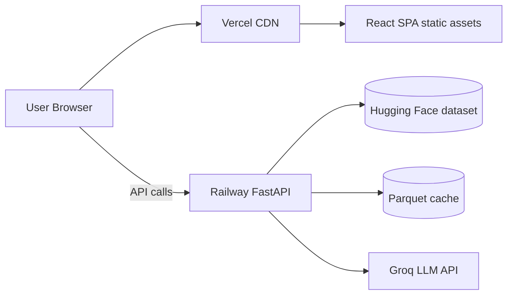
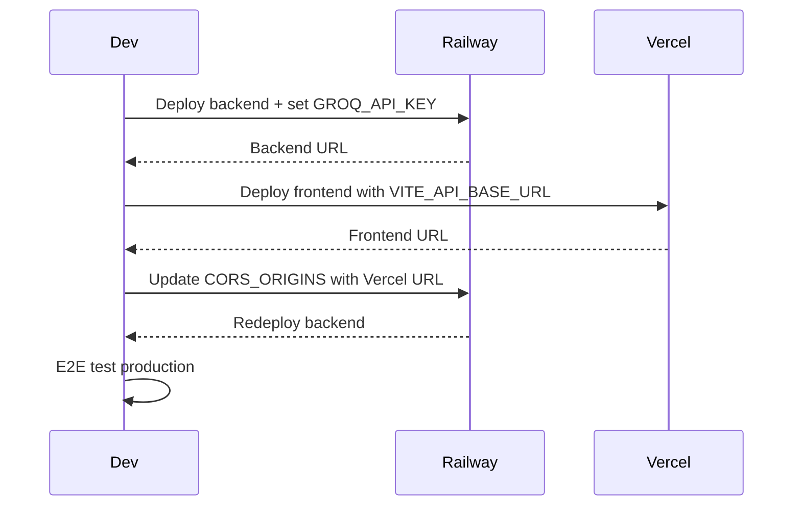

# Deployment Plan — Zomato AI Restaurant Recommender

Deploy the **FastAPI backend** on [Railway](https://railway.app) and the **Vite + React frontend** on [Vercel](https://vercel.com).

## Architecture



| Layer | Stack | Entry point |
|-------|-------|-------------|
| Frontend | Vite 6, React 18, TypeScript | `frontend/` → `npm run build` → `dist/` |
| Backend | FastAPI, Uvicorn, Python 3.10+ | `app.api.main:app` |

---

## Prerequisites

- GitHub repository with this project pushed to `main` (or your deploy branch)
- [Groq API key](https://console.groq.com/) for LLM recommendations
- Railway account (Hobby plan is sufficient for demos)
- Vercel account (Hobby plan is sufficient for demos)
- Local verification before deploying:

```bash
# Backend
python -m venv .venv && .venv\Scripts\activate   # Windows
pip install -r requirements.txt
uvicorn app.api.main:app --reload --port 8000

# Frontend (separate terminal)
cd frontend
npm install
npm run dev
```

---

## Pre-deployment checklist

- [ ] `.env` and `frontend/.env` are **not** committed (already in `.gitignore`)
- [ ] `GROQ_API_KEY` is ready for Railway secrets
- [ ] Backend starts locally and `/ready` reports `dataset_loaded: true`
- [ ] Frontend builds locally: `cd frontend && npm run build`
- [ ] You know your production URLs (fill in after first deploy):
  - Backend: `https://<your-service>.up.railway.app`
  - Frontend: `https://<your-project>.vercel.app`

---

## Part 1 — Backend on Railway

### 1.1 Create the Railway project

1. Go to [railway.app](https://railway.app) → **New Project** → **Deploy from GitHub repo**.
2. Select this repository.
3. Railway auto-detects Python from `requirements.txt` at the repo root. **Do not** set the root directory to `frontend/`.

### 1.2 Configure build and start

In the service **Settings → Deploy**:

| Setting | Value |
|---------|-------|
| **Root Directory** | `/` (repository root) |
| **Build Command** | *(leave empty — Nixpacks runs `pip install -r requirements.txt`)* |
| **Start Command** | `uvicorn app.api.main:app --host 0.0.0.0 --port $PORT` |

Railway injects `$PORT` automatically. Do not hardcode port `8000`.

**Optional:** add a `railway.toml` at the repo root for reproducible config:

```toml
[build]
builder = "nixpacks"

[deploy]
startCommand = "uvicorn app.api.main:app --host 0.0.0.0 --port $PORT"
healthcheckPath = "/health"
healthcheckTimeout = 300
restartPolicyType = "on_failure"
```

The extended healthcheck timeout helps the first deploy while the Hugging Face dataset downloads.

### 1.3 Environment variables (Railway)

In **Variables**, add:

| Variable | Required | Example / notes |
|----------|----------|-----------------|
| `GROQ_API_KEY` | Yes | `gsk_...` from Groq console |
| `CORS_ORIGINS` | Yes | `https://your-app.vercel.app` (add preview URLs if needed) |
| `LLM_MODEL` | No | `llama-3.3-70b-versatile` (default) |
| `LLM_TEMPERATURE` | No | `0.3` |
| `MAX_CANDIDATES_FOR_LLM` | No | `20` |
| `DEFAULT_TOP_K` | No | `5` |
| `BUDGET_LOW_MAX` | No | `500` |
| `BUDGET_MEDIUM_MAX` | No | `1500` |
| `DATASET_CACHE_PATH` | No | `/tmp/data/cache/restaurants.parquet` (see caching note below) |

**CORS:** `app/config.py` reads `CORS_ORIGINS` as a comma-separated list. After Vercel deploy, set:

```
CORS_ORIGINS=https://your-project.vercel.app,https://your-project-*.vercel.app
```

Railway does not support wildcards in env vars — add each preview origin you use, or redeploy backend when you add a stable production domain.

### 1.4 Dataset cache and cold start

On startup, the API loads restaurants via `get_restaurant_store()`:

1. If `DATASET_CACHE_PATH` exists → load from Parquet (fast).
2. Otherwise → download `ManikaSaini/zomato-restaurant-recommendation` from Hugging Face, preprocess, and write cache (slow, ~1–3 minutes).

Railway’s filesystem is **ephemeral** by default. Each redeploy may re-download the dataset unless you persist cache.

**Recommended options (pick one):**

| Strategy | Pros | Cons |
|----------|------|------|
| **A. Accept cold start** | Zero extra setup | First request after deploy is slow; `/ready` may show `not_ready` briefly |
| **B. Railway Volume** | Cache survives redeploys | Small extra cost; mount volume at `/data` and set `DATASET_CACHE_PATH=/data/cache/restaurants.parquet` |
| **C. Pre-warm on deploy** | Predictable startup | Add a release-phase script that runs dataset load before traffic (Railway **Settings → Deploy → Custom Start** or a one-off job) |

For a fellowship demo, **Option B (Volume)** is the best balance of reliability and simplicity.

### 1.5 Generate public URL

1. Open the service → **Settings → Networking** → **Generate Domain**.
2. Note the URL, e.g. `https://zomato-api-production.up.railway.app`.
3. Verify:

```bash
curl https://<your-railway-domain>/health
curl https://<your-railway-domain>/ready
```

Expected: `/health` → `{"status":"ok"}`. `/ready` → `status: "ready"`, `dataset_loaded: true`, `groq_configured: true`.

### 1.6 Python version

Pin Python **3.10+** if Railway picks an older default. Add `runtime.txt` at repo root:

```
python-3.11.9
```

Or set `NIXPACKS_PYTHON_VERSION=3.11` in Railway variables.

---

## Part 2 — Frontend on Vercel

### 2.1 Import project

1. Go to [vercel.com](https://vercel.com) → **Add New** → **Project**.
2. Import the same GitHub repository.
3. Set **Root Directory** to `frontend` (critical — do not deploy from repo root).

### 2.2 Build settings

Vercel should auto-detect Vite. Confirm:

| Setting | Value |
|---------|-------|
| **Framework Preset** | Vite |
| **Build Command** | `npm run build` |
| **Output Directory** | `dist` |
| **Install Command** | `npm install` |

### 2.3 Environment variables (Vercel)

In **Project → Settings → Environment Variables**:

| Variable | Environments | Value |
|----------|--------------|-------|
| `VITE_API_BASE_URL` | Production, Preview, Development | `https://<your-railway-domain>` (no trailing slash) |

`VITE_*` variables are embedded at **build time**. After changing `VITE_API_BASE_URL`, trigger a **redeploy** on Vercel.

The frontend reads this in `frontend/src/lib/api-client.ts`:

```ts
const API_BASE = import.meta.env.VITE_API_BASE_URL ?? "http://localhost:8000";
```

### 2.4 SPA routing (optional)

The app is currently a single page with no client-side router. If you add routes later, create `frontend/vercel.json`:

```json
{
  "rewrites": [{ "source": "/(.*)", "destination": "/index.html" }]
}
```

### 2.5 Deploy and verify

1. Click **Deploy**.
2. Open the Vercel URL.
3. Confirm the preference form loads locations/cuisines from the API.
4. Submit a recommendation request and verify results render.

---

## Part 3 — Wire backend and frontend together

Deploy order matters:



1. Deploy **backend first** → get Railway URL.
2. Deploy **frontend** with `VITE_API_BASE_URL` pointing to Railway.
3. Update Railway `CORS_ORIGINS` with the Vercel production URL → redeploy backend.
4. Run end-to-end test on production.

---

## Environment variable reference

### Backend (Railway)

| Variable | Default | Description |
|----------|---------|-------------|
| `GROQ_API_KEY` | — | Groq API key; required for LLM ranking |
| `LLM_MODEL` | `llama-3.3-70b-versatile` | Groq model id |
| `LLM_TEMPERATURE` | `0.3` | Sampling temperature (0–1) |
| `MAX_CANDIDATES_FOR_LLM` | `20` | Max restaurants sent to LLM |
| `DEFAULT_TOP_K` | `5` | Default recommendation count |
| `DATASET_CACHE_PATH` | `./data/cache/restaurants.parquet` | Parquet cache location |
| `BUDGET_LOW_MAX` | `500` | Low budget tier max (INR for two) |
| `BUDGET_MEDIUM_MAX` | `1500` | Medium budget tier max |
| `CORS_ORIGINS` | `http://localhost:5173,...` | Comma-separated allowed origins |

### Frontend (Vercel)

| Variable | Default | Description |
|----------|---------|-------------|
| `VITE_API_BASE_URL` | `http://localhost:8000` | Railway API base URL |

---

## Post-deployment verification

| Check | Command / action | Expected |
|-------|------------------|----------|
| API liveness | `GET /health` | `200`, `{"status":"ok"}` |
| API readiness | `GET /ready` | `200`, `dataset_loaded: true` |
| Metadata | `GET /api/locations` | JSON array of localities |
| Recommendations | `POST /api/recommendations` | JSON with ranked restaurants |
| CORS | Browser devtools → Network on Vercel site | No CORS errors on API calls |
| LLM | Submit form with valid preferences | Explanations present (not filter-only fallback) |

Sample recommendation request:

```bash
curl -X POST "https://<railway-domain>/api/recommendations" \
  -H "Content-Type: application/json" \
  -d '{
    "location": "Indiranagar",
    "budget": "medium",
    "cuisine": "North Indian",
    "min_rating": 4.0,
    "additional": [],
    "top_k": 3
  }'
```

---

## Troubleshooting

| Symptom | Likely cause | Fix |
|---------|--------------|-----|
| CORS error in browser | `CORS_ORIGINS` missing Vercel URL | Add exact origin (scheme + host, no path) on Railway and redeploy |
| Frontend calls `localhost:8000` | `VITE_API_BASE_URL` not set at build time | Set variable in Vercel → redeploy |
| `/ready` shows `not_ready` | Dataset still loading or HF download failed | Wait 2–3 min; check Railway logs; confirm outbound network allowed |
| Recommendations lack AI explanations | `GROQ_API_KEY` missing or invalid | Set key in Railway variables; check `/ready` → `groq_configured: true` |
| Slow every redeploy | Ephemeral cache | Use Railway Volume or pre-warm cache |
| `502` / service unavailable | App crashed on startup | Check logs for `BUDGET_LOW_MAX` validation or import errors |
| Build fails on Vercel | Wrong root directory | Set root to `frontend`, not repo root |
| Build fails on Railway | Missing dependency | Ensure `requirements.txt` is at repo root |

---

## Security notes

- Never commit `.env`, `frontend/.env`, or API keys.
- Use Railway and Vercel **secret** / **encrypted** variable UI for `GROQ_API_KEY`.
- The API has no authentication — suitable for a demo; add rate limiting or API keys before public production use.
- Groq keys are server-side only; the frontend never sees `GROQ_API_KEY`.

---

## Optional hardening (post-demo)

- [ ] Custom domains on Railway and Vercel
- [ ] Railway Volume for persistent dataset cache
- [ ] Vercel preview deployments with matching CORS entries
- [ ] GitHub Actions CI: `pytest` + `npm run build` on PR
- [ ] Rate limiting middleware on FastAPI
- [ ] Structured logging (Railway log drains)

---

## Quick reference — deploy commands

**Local backend (reference):**
```bash
uvicorn app.api.main:app --host 0.0.0.0 --port 8000
```

**Local frontend (reference):**
```bash
cd frontend && npm run build && npm run preview
```

**Production URLs to document in README after deploy:**
- API: `https://<railway-domain>`
- App: `https://<vercel-domain>`
